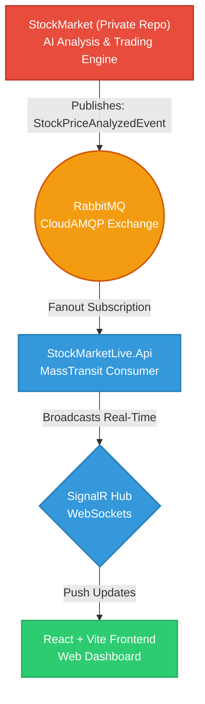

# StockMarket Live

> 🤖 **Note:** This project was architected and coded entirely by an AI Assistant.

StockMarket Live is a modern, real-time web application designed to consume and display AI-analyzed stock market signals. 

## 🏗️ Architecture & Ecosystem



This project is part of a distributed, event-driven ecosystem. It operates in tandem with a separate **private repository** named `StockMarket`.

*   **`StockMarket` (Private Repository) - The Publisher:** 
    A closed-source, autonomous algorithmic trading and financial analysis engine. It integrates directly with the **Alpaca Trading API** to automatically analyze and trade American **NASDAQ** stocks. 
    
    The engine employs a variety of advanced quantitative and technical trading strategies, such as:
    *   **AI-Driven Predictive Modeling**
    *   **Mean Reversion & Momentum**
    *   **Moving Average Convergence Divergence (MACD) Crossovers**
    
    Based on these strategies, it makes autonomous Buy/Sell/Hold decisions and publishes these real-time signals (`StockPriceAnalyzedEvent`) to a RabbitMQ message broker.
*   **`StockMarketLive` (This Repository) - The Consumer:**
    A real-time, user-facing web dashboard. It subscribes to the RabbitMQ exchanges via MassTransit, consumes the published AI signals, and broadcasts them securely to connected web clients via SignalR (WebSockets).

## 🚀 Technology Stack

**Backend:**
*   **.NET 10 (C# 14)**
*   **Clean Architecture** (Domain, Application, Infrastructure, Api)
*   **Entity Framework Core** (Code-First PostgreSQL)
*   **MassTransit & RabbitMQ** (Pub/Sub Fanout Exchange via CloudAMQP)
*   **SignalR** (Real-time WebSockets)
*   **Custom JWT Authentication & RBAC** 

**Frontend:**
*   **React + Vite + TypeScript**
*   **i18n** (Zero-Hardcode Multilingual Support - EN/TR)
*   **Vanilla CSS** (Premium Dark Mode with Micro-Animations)

## 🗄️ Database & Authentication

This project uses **Supabase** purely as a raw PostgreSQL hosting provider (via Session Pooler on Port 5432). 

> [!IMPORTANT]
> **We DO NOT use Supabase Auth.** To maintain full architectural control and avoid vendor lock-in, the entire Authentication and Role-Based Access Control (RBAC) system is custom-built using Entity Framework Core and standard ASP.NET Core JWT Bearer mechanisms.

The relational database architecture is defined via EF Core Code-First approach and includes the following tables for identity management:
*   `Users`: Core user credentials and profile data.
*   `Roles`: System roles (e.g., Admin, Editor).
*   `Permissions`: Granular permissions (e.g., `Trade.Execute`, `Signals.View`).
*   `UserRoles`: Many-to-many relationship mapping users to their respective roles.
*   `RolePermissions`: Many-to-many relationship mapping roles to specific system permissions.

## 🛡️ Zero-Hardcode & Security Policies

This project strictly adheres to enterprise-level security and quality standards:
*   **No Secrets in Code:** Sensitive credentials (like CloudAMQP Connection Strings, Supabase DB String, and JWT Keys) are NEVER hardcoded. They are managed exclusively via Environment Variables or `.NET User Secrets`.
*   **Zero Warnings Policy:** The `.NET` projects are configured with `<TreatWarningsAsErrors>true</TreatWarningsAsErrors>`. The project will not build if a single warning exists (SonarQube Analyzers enforced).
*   **Result Pattern:** Uses the `Result<T>` wrapper instead of throwing exceptions for predictable and safe control flow.
*   **Clean Code:** Strict adherence to keeping cognitive complexity low and enforcing the Single Responsibility Principle (SRP).

## ⚙️ Getting Started

### Prerequisites
*   .NET 10 SDK
*   Node.js & npm
*   A CloudAMQP (RabbitMQ) instance
*   A Supabase Project (PostgreSQL)

### Configuration
1. Initialize `.NET user-secrets` in the API project to securely store your credentials:
   ```bash
   cd backend/StockMarketLive.Api
   dotnet user-secrets init
   dotnet user-secrets set "ConnectionStrings:RabbitMq" "amqps://[USER]:[PASSWORD]@[SERVER].rmq.cloudamqp.com/[VHOST]"
   dotnet user-secrets set "ConnectionStrings:DefaultConnection" "Host=db.[YOUR_PROJECT_ID].supabase.co;Port=5432;Database=postgres;Username=postgres;Password=[YOUR_PASSWORD];Pooling=false;SSL Mode=Require;Trust Server Certificate=true"
   dotnet user-secrets set "Jwt:Key" "[YOUR_SUPER_SECRET_JWT_KEY]"
   dotnet user-secrets set "Jwt:Issuer" "StockMarketLive"
   dotnet user-secrets set "Jwt:Audience" "StockMarketLiveUsers"
   ```

### Running the Backend
```bash
cd backend/StockMarketLive.Api
dotnet run
```

### Running the Frontend
```bash
cd frontend
npm install
npm run dev
```

## 📄 License

This project is licensed under the **Apache License 2.0**. See the [LICENSE](LICENSE.txt) file for more details.